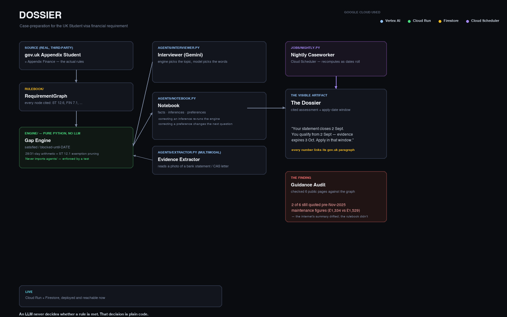

# Dossier

**It reads the actual UK immigration rulebook — not the internet's summary of it —
and tells you the exact date window when you'll qualify for your student visa.**

Built for the All Things Agentic Hackathon (Collaborative Partner track).

Live demo: https://dossier-console-qupwgyb5aq-uc.a.run.app

---

## The problem, in one sentence

The UK raised student visa maintenance funds on 11 November 2025 — and not every
guide caught up. Follow an outdated page and you under-save by hundreds of pounds,
hold the wrong balance for the required 28 days, and get refused for doing exactly
what you were told.

## What we found

We checked six real, published UK student-visa guidance pages — university
international-office pages and PDFs — against the actual current rules.

**Two of the six still quoted the pre-11-November-2025 maintenance figures**
(£1,334/£1,023 a month) instead of the current amounts (£1,529/£1,171). Full method
and result, reported honestly either way: [`docs/GUIDANCE_AUDIT.md`](docs/GUIDANCE_AUDIT.md).

That's the reason this project exists in this shape: the rules are public, but the
internet's summary of them drifts, and nobody applying for a visa can tell which
version of a page they're looking at.

## The idea

An LLM must never decide what the law requires. Requirements are extracted once from
the real gov.uk rulebook into a **deterministic, versioned, paragraph-cited
`RequirementGraph`**. Eligibility and every date calculation run as **plain Python**
over that graph — a test asserts the engine never imports anything from the agent
code, so this isn't a claim, it's enforced. Gemini interviews you, reads your
documents, and explains the result — it never adjudicates whether a rule is met.

Two documents split the requirement in a way nobody holds in their head:

| Rule | Source | Says |
|---|---|---|
| ST 12.3 | Appendix Student | £1,529/mo London, £1,171/mo outside, ×9 months + fees |
| ST 12.4 | Appendix Student | Sponsor-arranged accommodation offset, capped at £1,529 |
| ST 12.6 | Appendix Student | Funds held a **consecutive 28-day period** |
| FIN 7.1 | Appendix Finance | Evidence dated within **31 days** of applying |
| FIN 7.2 | Appendix Finance | The 28 days count **back from the closing balance date** |
| ST 12.1 | Appendix Student | 12+ months already in the UK → **requirement waived entirely** |

Dossier computes the interaction: *"Your statement closes 2 Sept. You qualify from
2 Sept — your evidence expires 3 Oct. Apply in that window."* And when ST 12.1
applies, one interview answer collapses an entire branch of questions — the
"constantly adapts to the user's unique way of thinking" the track asks for, made
visible rather than asserted.

## What it does

- **Leads the interview.** The engine ranks unresolved rule-graph nodes by how much
  each answer would prune, so the highest-information question comes first — not a
  static form marched top to bottom.
- **Takes real notes.** Every confirmed answer becomes a note in the Notebook, shown
  alongside a separate note for how you'd like to be asked questions.
- **Two kinds of correction, two different effects.** Editing a fact re-runs the
  entire assessment — the required amount and apply-date window actually recalculate.
  Editing the question-style preference changes only phrasing; the eligibility result
  never moves. The notebook data model also supports a third note kind, `inference`
  (a value the system derived rather than one you confirmed), for a future release —
  the live console doesn't create or surface these yet.
- **Works while you're not looking.** A Cloud Scheduler job recomputes every open
  case nightly as the real date moves forward, and writes a morning briefing — the
  autonomy the hackathon's theme asks for, not a button you press.

It is not legal advice, and it never submits an application.

## Architecture



**Google Cloud used:** Vertex AI (Gemini 3.5 Flash for interview turns and document
extraction, Gemini Pro-tier reasoning for briefings), Cloud Run (the console),
Firestore (case facts, notebook, graph), Cloud Scheduler (the nightly recheck).

**Framework:** the `google-genai` SDK against Vertex AI — same stack as this
project's sibling submission, Crucible, for the Fortified Enterprise Fleet track.

## Project layout

```text
rulebook/  cited rule graph and graph loader — the reviewed source of truth
engine/    deterministic financial assessment, zero LLM calls, zero network calls
agents/    interview, multimodal evidence extraction, and the case notebook
jobs/      idempotent nightly recheck and morning briefing
console/   two-screen FastAPI interface (Interview, Dossier)
tests/     boundary tests + the guard that keeps engine/ independent of agents/
data/      local runtime data (not committed)
```

## Run the tests

```bash
python3 -m venv .venv
.venv/bin/pip install -r requirements.txt
.venv/bin/python -m pytest tests/ -v
```

## Run locally

```bash
.venv/bin/uvicorn console.main:app --reload
```

Open `http://127.0.0.1:8000`. The Interview screen saves only confirmed facts; the
Dossier screen recalculates the cited result and shows the latest local morning
briefing. Local case data stays in `data/` and is never committed.

## Verification

- **No LLM in the adjudication path**: `tests/test_gaps.py` asserts `engine/` imports
  nothing from `agents/` — the central claim is enforced by a test, not just stated.
- **Boundary correctness**: tests cover the 28-day holding window, the 31-day
  recency limit, and the ST 12.1 exemption pruning at their exact edges.
- **Third-party ground truth**: the rule graph was reviewed against the live official
  gov.uk pages on 24 August 2026 — see [`docs/RULEBOOK_REVIEW.md`](docs/RULEBOOK_REVIEW.md).
- **The finding**: [`docs/GUIDANCE_AUDIT.md`](docs/GUIDANCE_AUDIT.md) — checked
  against real, independently published guidance, reported honestly whichever way it
  came out.
- **Async proof**: the nightly job recomputes every open case unattended; a case that
  read "not yet eligible" on one day can read "eligible as of today" the next,
  without anyone touching a button.

## Rule sources

- [Immigration Rules: Appendix Student](https://www.gov.uk/guidance/immigration-rules/appendix-student)
- [Immigration Rules: Appendix Finance](https://www.gov.uk/guidance/immigration-rules/immigration-rules-appendix-finance)

Immigration rules can change. Confirm the cited sources directly before relying on
any assessment — Dossier links the exact paragraph behind every number it shows.

This version assesses the cash-evidence route only; it does not cover the distinct
student-loan or official-sponsorship routes.

## Cost and deployment

Cloud Run runs with a dedicated Firestore-only runtime identity, `min-instances=0`,
and a maximum of one instance. A ₹800 monthly budget alert is live on the project.
The deterministic engine and full test suite run free, locally, with no cloud
dependency at all.

## What's next

- **Wire the multimodal extractor into the console.** `agents/extractor.py` defines
  the output shape for reading a bank statement or CAS letter image, but the live
  interview screen has no upload path yet — this is the next feature, not a claimed one.
- **Surface `inference` notes in the UI**, with a real per-note correction control,
  so a value the system derives (not just one the user confirms) is visibly
  correctable the same way a fact is.

## Live demo notice

The deployed demo is public and uses one shared, non-personal demonstration case.
**Do not enter real passport numbers, bank statements, or other personal data** into
the live instance.
